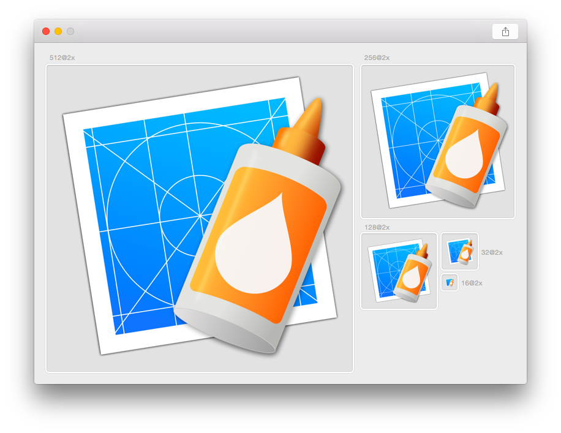

# Icns Composer #

If you're like me, you love the high quality icons OS X provides. And you probably like to create your own icons for one or another app. Since Apple doesn't support 1024x1024 retina images with 'Icon Composer' anymore, at least as far as I know, I decided to create a small app that does. __Icns Composer__. You can simply drag and drop your image onto Icns Composer, just like you did with Apple's Icon Composer, and click Export.

Visit the [homepage](http://behoernchen.github.io/icnscomposer/index.html) for more information.

#### Looking for a way to create Xcode image assets? ####
You want to create Xcode image assets (*.xcassets)? Make sure to check out [Iconizer](http://behoernchen.github.io/iconizer/index.html)!

## How do I install it? ##

You have two options:

1. Download the latest [release](https://github.com/behoernchen/IcnsComposer/releases) and drop it into your Applications folder.
2. Download the source code and build it with Xcode yourself.

## Contribute ##

You can fork this project, right here on Github, make your awesome changes and send me a pull request. Just make sure to fork the latest development version.

----------
### License ###

The MIT License (MIT)

Copyright (c) 2015 Raphael Hanneken

Permission is hereby granted, free of charge, to any person obtaining a copy of this software and associated documentation files (the "Software"), to deal in the Software without restriction, including without limitation the rights to use, copy, modify, merge, publish, distribute, sublicense, and/or sell copies of the Software, and to permit persons to whom the Software is furnished to do so, subject to the following conditions:

The above copyright notice and this permission notice shall be included in all copies or substantial portions of the Software.

THE SOFTWARE IS PROVIDED "AS IS", WITHOUT WARRANTY OF ANY KIND, EXPRESS OR IMPLIED, INCLUDING BUT NOT LIMITED TO THE WARRANTIES OF MERCHANTABILITY, FITNESS FOR A PARTICULAR PURPOSE AND NONINFRINGEMENT. IN NO EVENT SHALL THE AUTHORS OR COPYRIGHT HOLDERS BE LIABLE FOR ANY CLAIM, DAMAGES OR OTHER LIABILITY, WHETHER IN AN ACTION OF CONTRACT, TORT OR OTHERWISE, ARISING FROM, OUT OF OR IN CONNECTION WITH THE SOFTWARE OR THE USE OR OTHER DEALINGS IN THE SOFTWARE.
